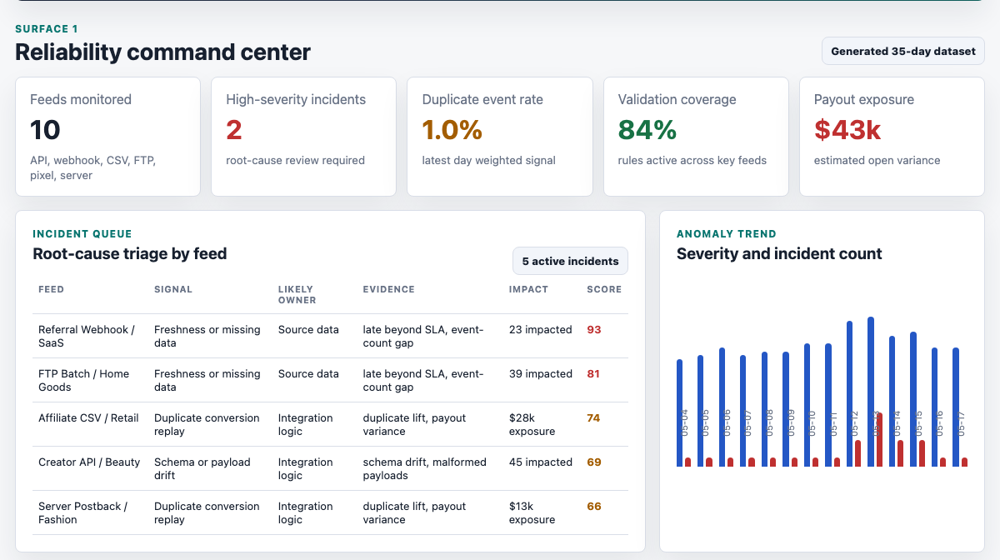
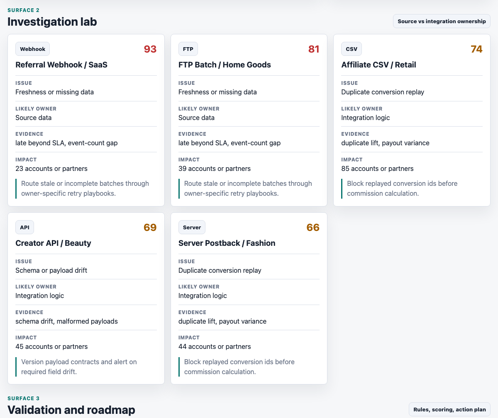
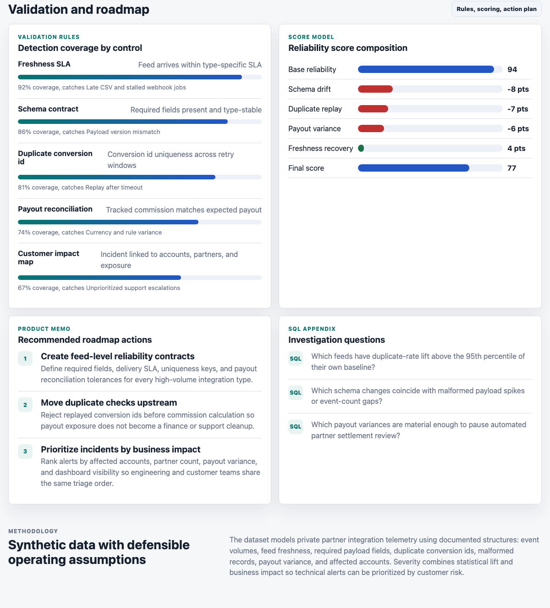

# Partner Data Reliability Workbench

This project is a portfolio artifact for a data reliability analyst role in the partnership marketing and commerce platform domain. It models how an analyst can investigate partner integration data, distinguish source-data problems from integration-logic issues, size customer and payout risk, and turn recurring reliability signals into product and engineering recommendations.

The artifact is intentionally more than a dashboard. It includes a deterministic synthetic data generator, generated event and incident datasets, validation-rule coverage, root-cause diagnostics, SQL investigation prompts, and a roadmap memo.

## Screenshots



**Reliability command center.** This surface gives the operating readout: monitored feeds, high-severity incidents, duplicate-event rate, validation coverage, payout exposure, a root-cause incident queue, and a 14-day anomaly trend.



**Investigation lab.** This surface shows feed-level diagnostic cards with the issue type, likely owner, evidence, impacted accounts or partners, and recommended product action.



**Validation and roadmap.** This surface documents validation controls, reliability score composition, roadmap recommendations, and SQL questions for deeper investigation.

## What The Artifact Demonstrates

- Analytical investigation of partner feed anomalies across APIs, webhooks, CSV files, FTP batches, server postbacks, and pixels.
- Root-cause separation between source-data problems, integration-logic defects, and shared edge cases.
- Reliability KPIs that connect technical data quality issues to customer-facing risk.
- Validation rules for freshness, schema contracts, duplicate conversion ids, payout reconciliation, and customer impact mapping.
- Product-aware recommendations that translate recurring data issues into roadmap-ready actions.
- SQL framing for anomaly review, incident prioritization, and payout variance investigation.

## Data

The data is synthetic because customer-level integration, conversion, payout, and partner data is private. It does not represent any real platform, customer, partner, or financial performance.

Generated files:

- `data/integration_reliability_events.csv`, 350 daily feed observations across 10 synthetic integrations and 35 days.
- `data/reliability_incidents.csv`, severity-ranked incident rows derived from the full dataset.
- `src/data.js`, the front-end summary object generated from the same source rows.
- `sql/reliability_investigation_queries.sql`, SQL examples for duplicate lift, ownership diagnosis, schema drift, and incident prioritization.

The generator in `scripts/generate_data.js` creates feed-level telemetry using these assumptions:

- API and server postback feeds have shorter freshness SLAs than CSV and FTP batch feeds.
- Each feed has a baseline event volume, duplicate rate, SLA, and modeled partner count.
- Daily volume follows a small weekly pattern plus random noise.
- Injected incident scenarios include schema drift, retry replay, payout reconciliation variance, stale webhooks, and late batch delivery.
- Severity combines freshness delay, duplicate-rate lift, schema drift, malformed payload rate, payout variance, and event-count gaps.
- Likely ownership is inferred from source and integration evidence scores.

Full field definitions are in `data_dictionary.md`.

## Project Structure

```text
.
|-- data/
|   |-- integration_reliability_events.csv
|   `-- reliability_incidents.csv
|-- docs/images/
|   |-- command-center.png
|   |-- investigation-lab.png
|   `-- validation-roadmap.png
|-- scripts/generate_data.js
|-- sql/reliability_investigation_queries.sql
|-- src/app.js
|-- src/data.js
|-- src/styles.css
|-- data_dictionary.md
`-- index.html
```

## Run Locally

```bash
npm run generate
python3 -m http.server 4173
```

Then open `http://localhost:4173`.

If port 4173 is already in use, run:

```bash
python3 -m http.server 4273
```

## Scope

This project is a front-end portfolio artifact with a reproducible synthetic data layer. It demonstrates investigation logic, validation design, metric framing, and communication of recommended fixes.

It does not connect to real customer systems, run scheduled monitoring jobs, or write back to production issue trackers. Those would be natural next steps in a production implementation.
