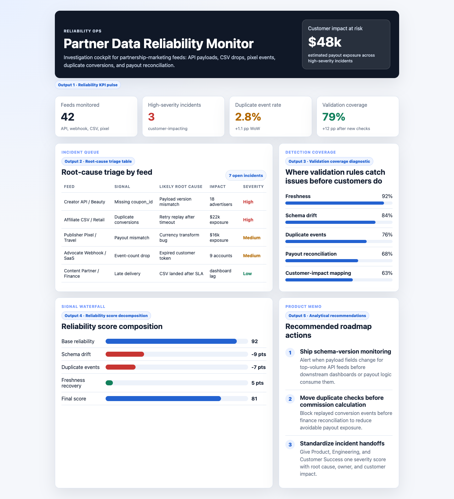

# Partner Data Reliability Monitor

I built this because partnership data reliability is not just an engineering hygiene problem; it affects advertiser trust, commission accuracy, customer support load, and roadmap priority. For a partnership-marketing platform, the important work is connecting late, duplicated, malformed, or unreconciled feeds to the customer and payout risk they create. This project shows how I would investigate feed issues, diagnose root causes, and translate reliability risk into product and engineering actions.



## Why this exists

impact.com-style partnership data flows through APIs, webhooks, CSV files, and tracking pixels. When that data is late, duplicated, malformed, or unreconciled, teams need an investigation view that separates source-data issues from integration logic errors and customer-impact risk.

## What is in the project

- A polished dashboard in `index.html`
- Modular UI/data files in `src/`
- Synthetic integration reliability data in `synthetic_reliability_data.csv`
- A data dictionary and methodology notes in `data_dictionary.md`
- A screenshot captured from the rendered app in `docs/images/dashboard.png`

## Dashboard sections

- Reliability pulse: monitored feeds, open incidents, duplicate-event rate, and validation coverage
- Incident queue: likely root cause and impact by feed
- Detection coverage: freshness, schema drift, duplicate checks, payout reconciliation, and impact mapping
- Reliability score composition: how each signal affects the operating score
- Product memo: roadmap actions for schema monitoring, duplicate prevention, and incident handoffs

## What the data says

The synthetic incident data shows that the highest customer risk is concentrated in feeds where data reliability and money movement intersect. Duplicate conversion events and payout-reconciliation gaps create immediate advertiser and partner trust risk because they can change reporting totals, commission exposure, and customer support volume.

The incident queue suggests two different problem classes. API freshness issues are operationally visible and can usually be handled with monitoring and retries. Schema drift and duplicate tracking are more dangerous because they can look like valid data until downstream reports or payouts disagree. That is why the dashboard separates the signal, likely root cause, customer impact, and severity instead of only showing an alert count.

The coverage view shows that freshness checks are strong, while payout reconciliation and customer-impact mapping need more coverage. The recommendation is to prioritize validation rules that connect technical issues to customer-facing consequences: "this feed is stale" matters, but "this feed creates payout exposure for these advertisers" is what makes the incident actionable.

## Output walkthrough

### Output 1: Reliability KPI pulse

This gives a fast operations readout: monitored feeds, open incidents, duplicate-event rate, validation coverage, and estimated customer impact. It answers whether reliability is improving or whether customer trust is currently at risk.

### Output 2: Root-cause triage table

This table is the analyst workspace. It maps each feed issue to a likely root cause, estimated impact, and severity so product, support, and engineering can act from the same evidence.

### Output 3: Validation coverage diagnostic

This section explains where automated checks already protect the business and where gaps remain. It helps prioritize whether the next investment should be schema monitoring, duplicate detection, payout reconciliation, or incident routing.

### Output 4: Reliability score decomposition

The waterfall shows how each reliability signal contributes to the operating score. It makes tradeoffs visible, especially when one strong area like freshness is offset by weaker payout or duplicate-event controls.

### Output 5: Analytical recommendations

The memo converts the analysis into roadmap actions: harden schema-drift detection, add duplicate-conversion prevention before payout calculation, and improve customer-impact mapping so incidents can be ranked by business exposure.

## Run locally

```bash
python3 -m http.server 4173
```

Then open `http://localhost:4173`.

## Resume-ready summary

Built partner-data reliability monitor with synthetic conversion, API, and payout feeds, surfacing schema drift, duplicate events, and anomaly alerts for integration roadmap prioritization and customer-impact triage.
